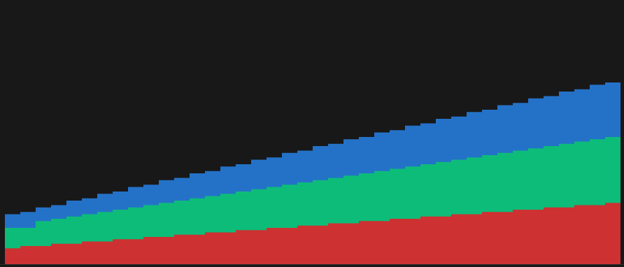

# ratatui-stacked-bar

A [ratatui](https://ratatui.rs/) widget that renders stacked area charts in the terminal.

Each data series is drawn on top of the previous one using Unicode block characters at 1/8-cell
resolution. When multiple series compress into a single terminal cell, the widget picks the two
dominant colors and blends them using foreground/background styling.

## Installation

```toml
[dependencies]
ratatui = "0.29"
ratatui-stacked-bar = { path = "..." }  # or version once published
```

## Usage

```rust
use ratatui::style::Color;
use ratatui::widgets::Widget;
use ratatui_stacked_bar::StackedSparkline;

// Inside your Widget::render or Frame::render_widget call:
StackedSparkline::default()
    .add_data(coverage_alt_data, Color::Blue)
    .add_data(coverage_total_data, Color::Green)
    .max(y_max)
    .render(area, buf);
```

Data series are stacked bottom-to-top in the order they are added. The first call to `add_data`
is the bottommost layer; each subsequent call stacks on top.

If `.max()` is not called, the widget scales to the largest value across all series.

## Example

See [`examples/example.rs`](examples/example.rs) for a runnable demo.

```
cargo run --example example
```


